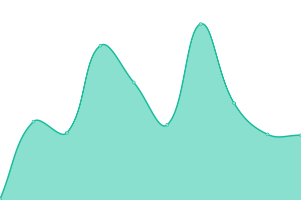

# [📈 Live Status](https://talka.ai): <!--live status--> **🟩 All systems operational**

This repository contains the open-source uptime monitor and status page for [TalkaOrg](https://talka.ai), powered by [Upptime](https://github.com/upptime/upptime).

With [Upptime](https://upptime.js.org), you can get your own unlimited and free uptime monitor and status page, powered entirely by a GitHub repository. We use [Issues](https://github.com/TalkaOrg/talka-status-dashboard/issues) as incident reports, [Actions](https://github.com/TalkaOrg/talka-status-dashboard/actions) as uptime monitors, and [Pages](https://talka.ai) for the status page.

<!--start: status pages-->
<!-- This summary is generated by Upptime (https://github.com/upptime/upptime) -->
<!-- Do not edit this manually, your changes will be overwritten -->
<!-- prettier-ignore -->
| URL | Status | History | Response Time | Uptime |
| --- | ------ | ------- | ------------- | ------ |
|  [Talka Insights](https://insights.talka.ai) | 🟩 Up | [talka-insights.yml](https://github.com/TalkaOrg/talka-status-dashboard/commits/HEAD/history/talka-insights.yml) | 

 218ms
     
 | 

<a href="https://TalkaOrg.github.io/talka-status-dashboard/history/talka-insights">100.00%</a>
    

|  [Talka Intelligence Service](https://models-results.talka.ai) | 🟩 Up | [talka-intelligence-service.yml](https://github.com/TalkaOrg/talka-status-dashboard/commits/HEAD/history/talka-intelligence-service.yml) | 

 213ms
     
 | 

<a href="https://TalkaOrg.github.io/talka-status-dashboard/history/talka-intelligence-service">100.00%</a>
    

|  [Talka Salesforce Service](https://salesforce-platform.talka.ai) | 🟩 Up | [talka-salesforce-service.yml](https://github.com/TalkaOrg/talka-status-dashboard/commits/HEAD/history/talka-salesforce-service.yml) | 

 188ms
     
 | 

<a href="https://TalkaOrg.github.io/talka-status-dashboard/history/talka-salesforce-service">99.47%</a>
    

|  [Talka Hubspot Service](https://hubspot-platform.talka.ai) | 🟩 Up | [talka-hubspot-service.yml](https://github.com/TalkaOrg/talka-status-dashboard/commits/HEAD/history/talka-hubspot-service.yml) | 

 1031ms
     
 | 

<a href="https://TalkaOrg.github.io/talka-status-dashboard/history/talka-hubspot-service">99.47%</a>
    

<!--end: status pages-->

[**Visit our status website →**](https://talka.ai)

## 📄 License

- Powered by: [Upptime](https://github.com/upptime/upptime)
- Code: [MIT](./LICENSE) © [Anand Chowdhary](https://anandchowdhary.com), supported by [Pabio](https://pabio.com)
- Data in the `./history` directory: [Open Database License](https://opendatacommons.org/licenses/odbl/1-0/)
